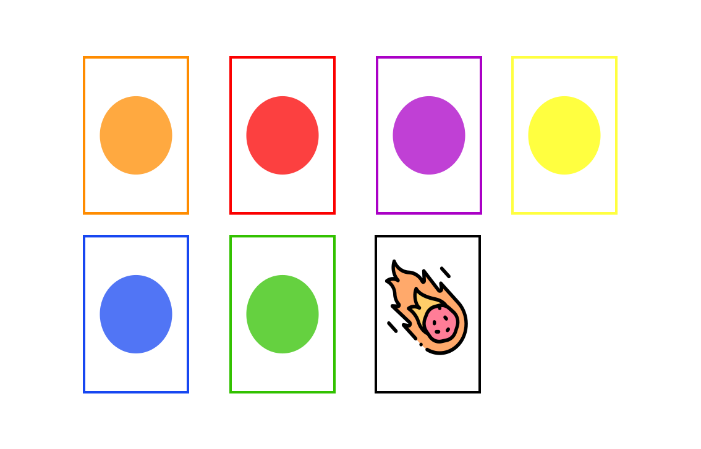

Dino Explosión

Hace aproximadamente 65 millones de años, los dinosaurios, criaturas de grandes dimensiones, estaban en la pirámide de la cadena alimenticia y eran quienes reinaban sobre la superficie de la tierra. En un día como cualquier otro, un gran cataclismo se aproximaba; un meteorito de mas de 11 kilómetros de diámetro se acercaba a la tierra y amenazaba con desaparecer toda forma de vida.

En este juego, el papel de los jugadores es trabajar cooperativamente para llevar a un refugio seguro a los dinosaurios y poder salvar un representante de las seis especies mas emblemáticas que existieron: brontosaurus, plesiosaurus, pterodactylus, stegosaurus, triceratops y tyrannosaurus rex.

Durante la partida de juego, los jugadores se encontraran con un pantalla que les presenta un tablero que representa la ruta que los jugadores tendrán que recorrer para llevar a los dinosaurios al refugio. A lo largo de la partida los jugadores se encontraran con el reto de los géiseres que pueden atemorizar a los dinosaurios y hacer que corran hasta el lugar seguro donde se encontraban anteriormente. Ademas, los jugadores tendrán la posibilidad de contar con poderes especiales que les permitirán evitar géiseres y avisar a sus compañeros de los obstáculos cercanos para evitar que caigan en ellos.

En la siguiente seccion de componentes se presenta una descripcion detallada de cada componente del juego con el objetivo de que los jugadores se familiarizen con el ambiente de juego.

### Componentes del  juego

 - Tablero

   En el tablero posee casillas de seis colores diferentes: amarillo, verde, naranja, azul, morado y rojo; y que llevan hasta el refugio en el que se protegeran los dinosaurios. El tablero posee una barra de proximidad del meteorito que indica que tan cerca se encuentra el metorioto de impactar la tierra y acabar con la existencia de todos los seres vivos y en consecuencia, con la partida.

     

   

 - Ficha de dinosaurio: hay un total de seis dinosaurios diferentes. El mínimo de jugadores que pueden jugar es dos y el máximo seis. Entre más dinosaurios haya, mayor es la dificultad.
   
   

     
   
   
   
 - Baraja de cartas: existen tres tipos de cartas. Las que son de alguno de los seis colores, las cartas de meteorito y las cartas de poder. 

 - Carta de meteorito: al comenzar, se coloca en la barra de proximidad en el extremo izquierdo "el espacio" y se mueve una posición cada vez que aparece una carta de meteorito, hasta que llegue al otro extremo "La tierra".

 - Mano de cartas: las cartas en mano de cada jugador con un maximo de tres por jugador.
   
   
   
   

Dino Explosion es un juego colaborativo basado en el juego Hoot Owl Hoot. Este es un juego de mesa colaborativo en el que pueden participar de 2 a 4 jugadores con la finalidad de llevar todos los búhos al nido antes de que amanezca.
https://boardgamegeek.com/boardgame/94483/hoot-owl-hoot

### Mecánica del juego original

En cada turno, cada jugador debe jugar alguna de sus cartas y mover su ficha de búho a la siguiente **posición disponible** del color de carta que escogió jugar. Si un jugador tiene una carta de sol, **está obligado** a jugarla y avanzar la ficha de sol en ese turno. Al finalizar su turno, el jugador debe coger una nueva carta de la pila de cartas y enviar a la pila de descarte la carta que acaba de utilizar. Si todos los búhos llegaron al nido antes de que la ficha de sol llegara al sol, entonces todos los jugadores ganan; pero si aún falta al menos un búho de entrar al nido y la ficha de sol llega a su punto máximo, el juego concluye y los jugadores pierden.

### Mecanica del juego adaptado

Al igual que en el original cada jugador debe de jugar una de sus cartas en su turno, tocando la carta el dinosaurio se mueve a la **posición disponible** del color de carta que escogió jugar. Si un jugador tiene una carta de meteorito, **está obligado** a jugarla y avanzar la ficha de meteorito en ese turno. En el tablero se encuentran ocultos geysers, binoculares que permiten ver el geyser mas cercano y huevos de dinosaurio que permiten jugar otro turno seguido.Si todos los dinosaurios llegaron a la cueva antes de que la ficha de meteorito llegara la tierra, entonces todos los jugadores ganan; pero si aún falta al menos un dinosaurio de entrar a la cueva y la ficha de meteorito llega a su punto máximo(la tierra), el juego concluye y los jugadores pierden. Dino Explosion extiende la cantidad de jugadores a seis.

### Adaptaciones en orden descendente de prioridades:

  1. Posicionar al azar en las casillas del tablero geysers ocultos. Si un jugador mueve su ficha a una posición donde haya un geyser, la ficha se devuelve a su posición anterior y dicha posición queda inutilizable.

  2. Posicionar al azar al igual que los geysers casillas con huevos de dinosaurio que les permiten moverse otra vez en el mismo turno (sacar y usar otra carta), si otro jugador cae en esta casilla ya utilizada no se activara ya el dinasaurio anterior utilizo el huevo. Estos están ocultos hasta que llega un caracter a esa posición.

  3. Posicionar al azar binoculares que le permitiran al jugador visualizar el geyser más cercano, y asi podrá evitarlo facilmente. 

Este proyecto es realizado por el equipo **Aldeser** compuesto por los estudiantes: Alexandra Siles, Dennis Solano y Sergio Fernández.
