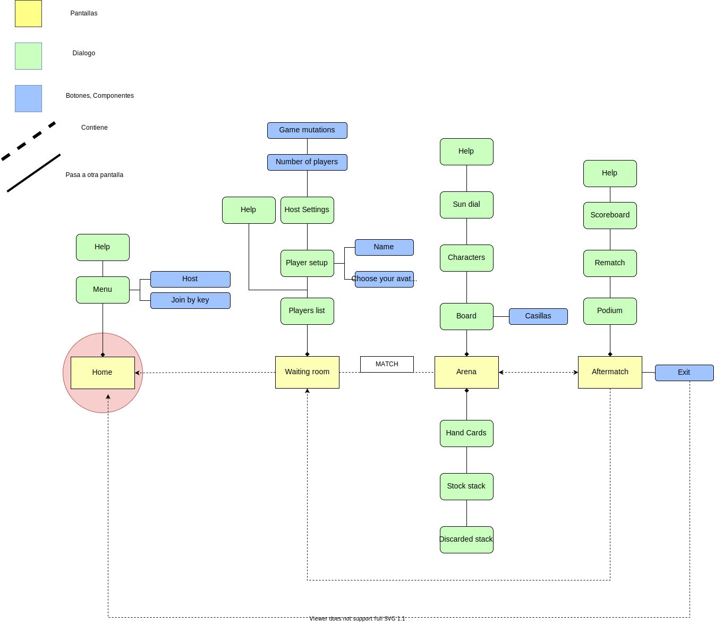
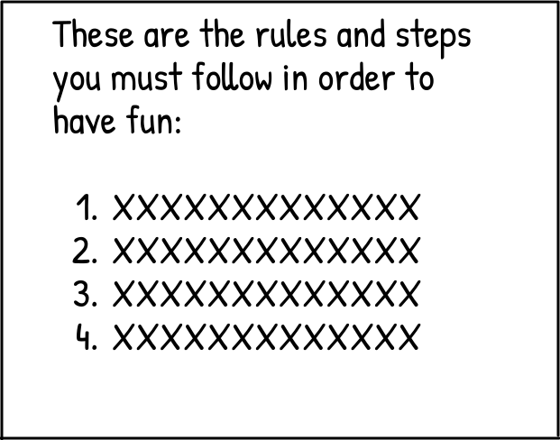
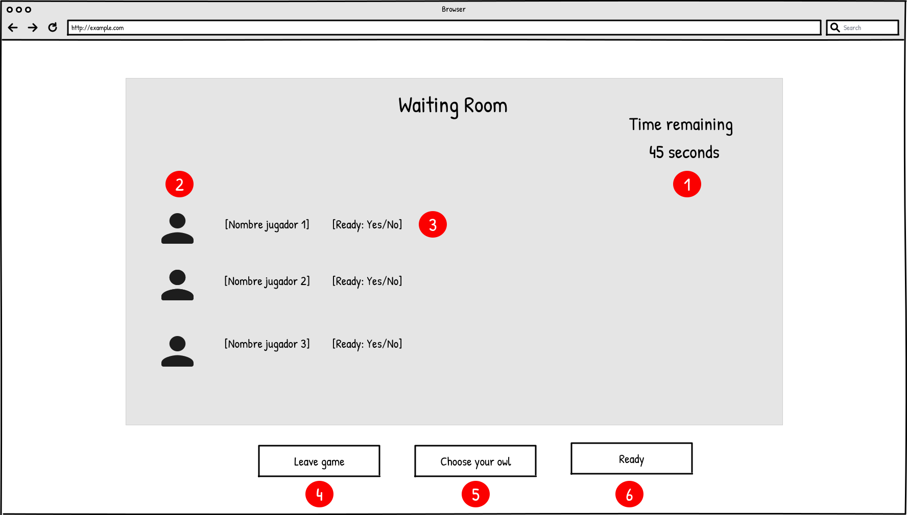
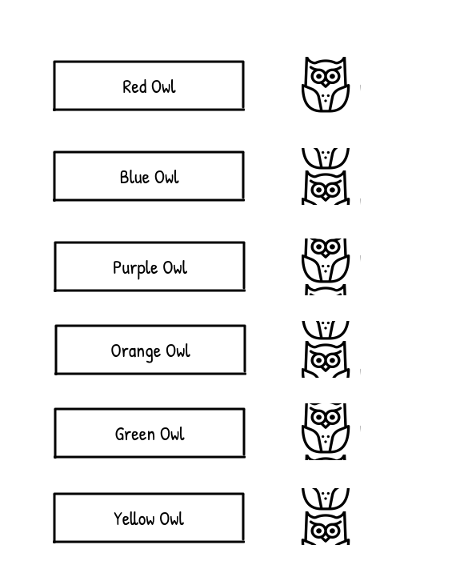
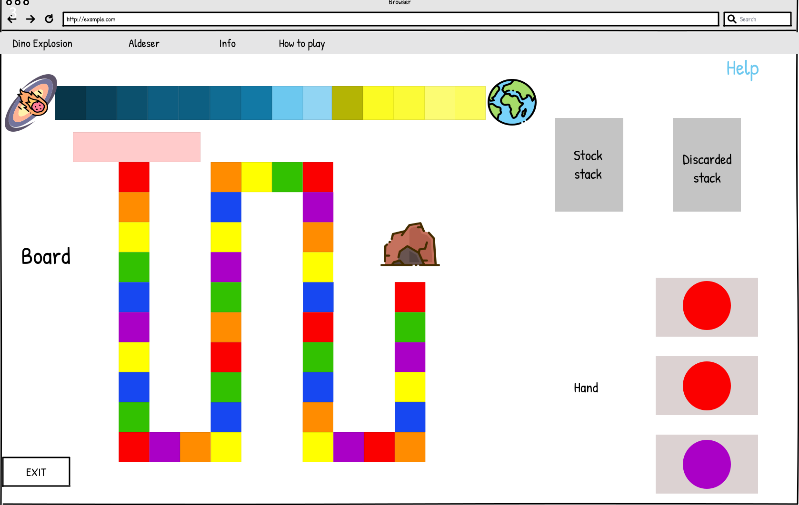
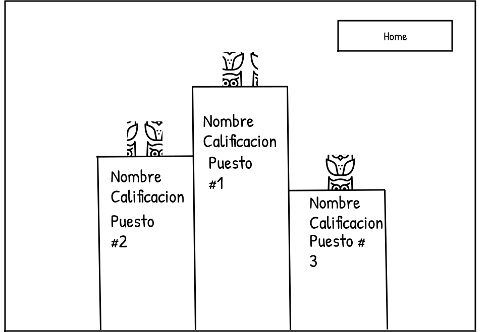

## Mapa del sitio

A continuación se detalla el diseño del mapa del sitio.

## Pantalla principal

El propósito de la pantalla principal es permitir al visitante elegir entre las siguientes tres opciones. 

Primera, solicitar ayuda .  Si el visitante selecciona la opción de solicitar ayuda será redirigido a la pantalla de ayuda (Figura 2) donde podrá obtener más información respecto al juego. Segunda, organizar un juego .  Si el visitante elige esta opción será redirigido a la pantalla de organización de juego donde podrá establer las configuraciones de la partida (Figura 5). Tercera, unirse a un juego . Si el jugador elige esta opción se le mostrará una ventana emergente (Figura 6) donde puede eligir de qué forma desea ingresar a una partida.

Figura 1. Pantalla principal

## Pantalla de ayuda

El propósito de esta pantalla es permitirle al visitante obtener información adicional referente cómo organizar una partida , cómo jugar  (reglas del juego) y una tercera opción para regresar a la pantalla principal . Si el visitante escoge la opción de información de cómo organizar una partida , se le mostrará una ventana emergente con la información de cómo organizar una partida (Figura 3). Por otra parte, si escoge la opción de cómo jugar , se le mostrará la una ventana emergente con la reglas del juego (Figura 4). Asimismo, el visitante tiene disponible la opción de regresar a la página principal . (Figura 1).

 Figura 2. Pantalla de ayuda

​                                                           Figura 3. Cómo organizar una partida

​                                                           Figura 4. Cómo jugar una partida

## Organizar una partida

El propósito de esta ventana emergente es permitirle al oganizardor de la partida establecer las configuraciones de la partida. Por ejemplo, establecer la cantidad máxima de jugadores , establecer la duración de la partida , establecer la probabilidad de encontrarse un bomba en los espacios disponibles  y establecer la probabilidad de encontrarse alguna mejora de habilidad en los espacios  entre otras. Adicionalmente, el organizardor tiene la posibilidad de cancelar la configuración y vover a la pantalla principal  y confirmar la configuración lo que establecerá por creada la partida y llevará al organizador a la sala de espera (Figura 7).

Figura 5. Organización de partida.

## Ingresar a una partida

El propósito de esta ventana emergente es permitirle al visitante escoger alguna de las dos modalides disponibles. La primera, unirse a una partida mediante una llave privada . Esta llave es provista por el organizador de la partida. La segunda, unirse a una partida aleatoria  que ya pudo haber comenzado. Luego de haber seleccionado cualquiera de las dos opciones, el ahora jugador será redirigido a la sala de espera de una partida (Figura 7). 

​                      Figura 6. Ventana emergente para unirse a partida

## Sala de espera

El propósito de esta pantalla es permitir tanto al organizador como a los jugadores poder observar el tiempo restante que queda para que inicie la partida , la lista de jugadores , la información de cada jugador , la opción de salir del juego y regresar a la pantalla principal   (Figura 1),  la opción de escoger el búho con el que se desea jugar  (Figura 8) y la opción para que le jugador eliga si está listo y ya ha finalizado con su configuración . Una vez finalizado el tiempo de espera o que todos los jugadores estén listos serán dirigidos a la pantalla de juego (Figura 9).

Figura 7. Sala de espera

Figura 8. Ventana emergente para elección de búho

El propósito de esta pantalla es permitir que los jugadores elijan su color de preferencia y asi distinguir a los jugadores en el juego.

## Juego

Figura 9.  Pantalla de juego

En esta pantalla se permite a los jugadores jugar de acuerdo a su turno

Figura 10. Calificación final

Al finalizar el juego o el tiempo se presentan los jugadores ganadores y sus calificaciones, y un botón para regresar a la pantalla principal
