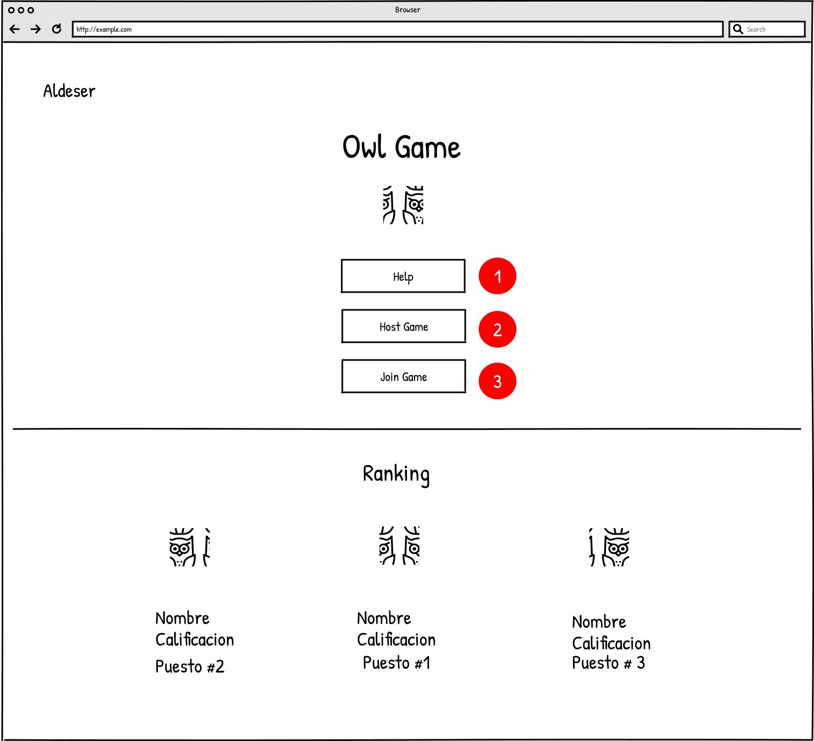

## Pantalla principal

El propósito de la pantalla principal es permitir al usuario elegir entre las siguientes tres opciones. Primera, solicitar ayuda. Si el usuario selecciona la opción de solicitar ayuda será redirigido a la pàntalla de ayuda donde podrá obtener más información respecto al juego. Segunda, organizar un juego. Si el usuario elige esta opción será redirigido a la pantalla de organizació de juego donde podrá establer las configuraciones de la partida. Tercera, unirse a un juego. Si el jugador elige esta opción se le mostrará una ventana emergente donde puede eligir de qué forma desea ingresar a una partida.

Figura 1. Pantalla principal.