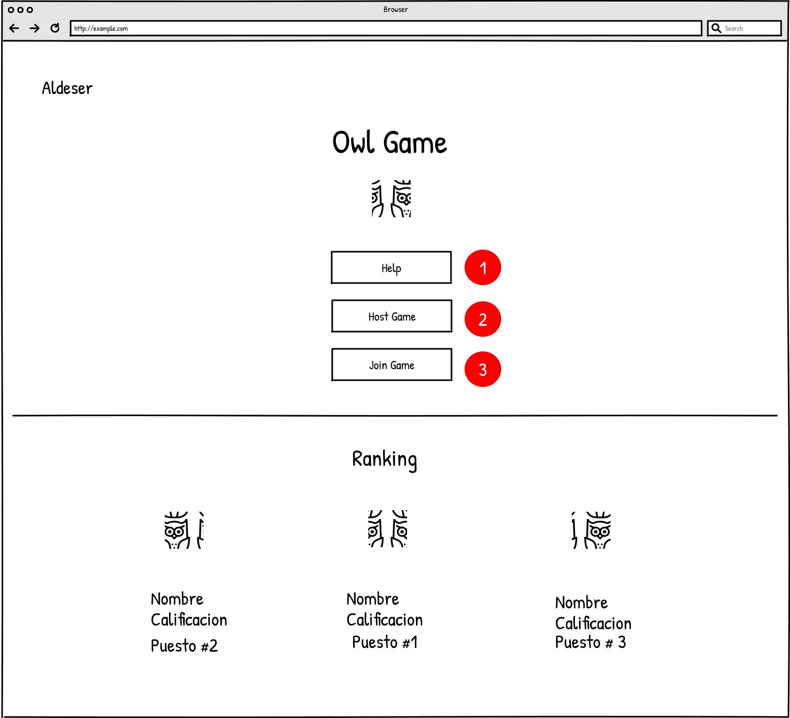
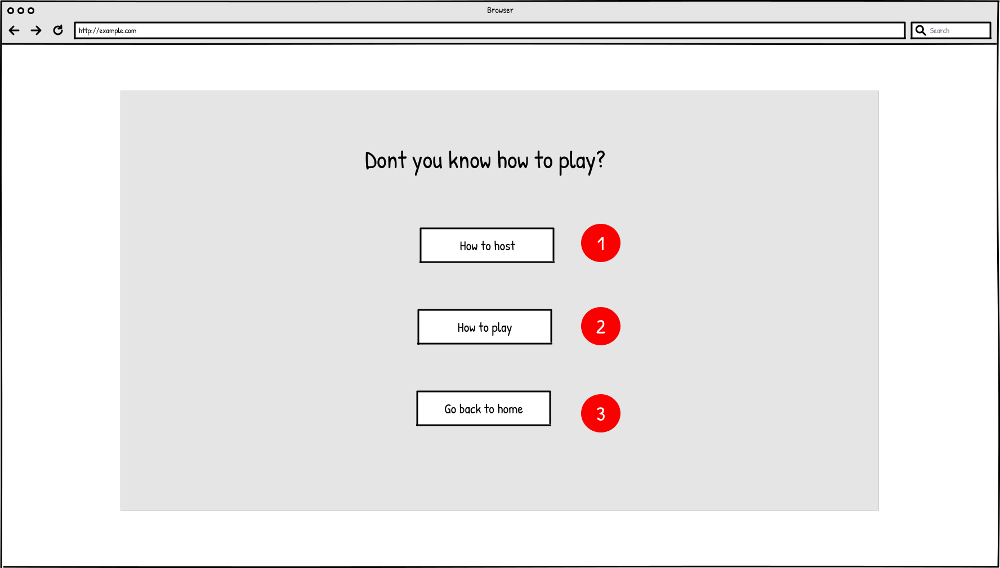
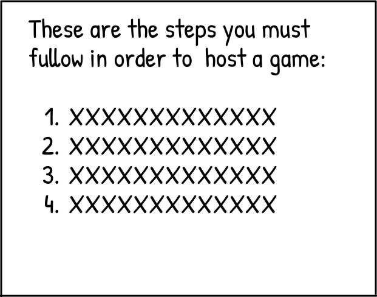
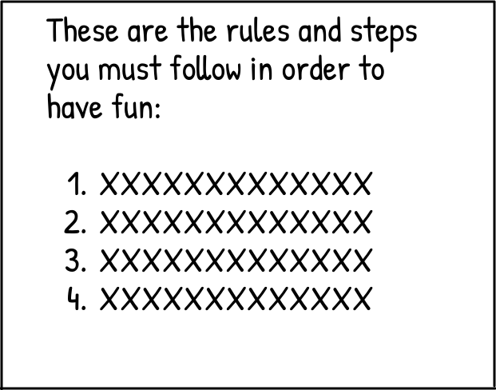
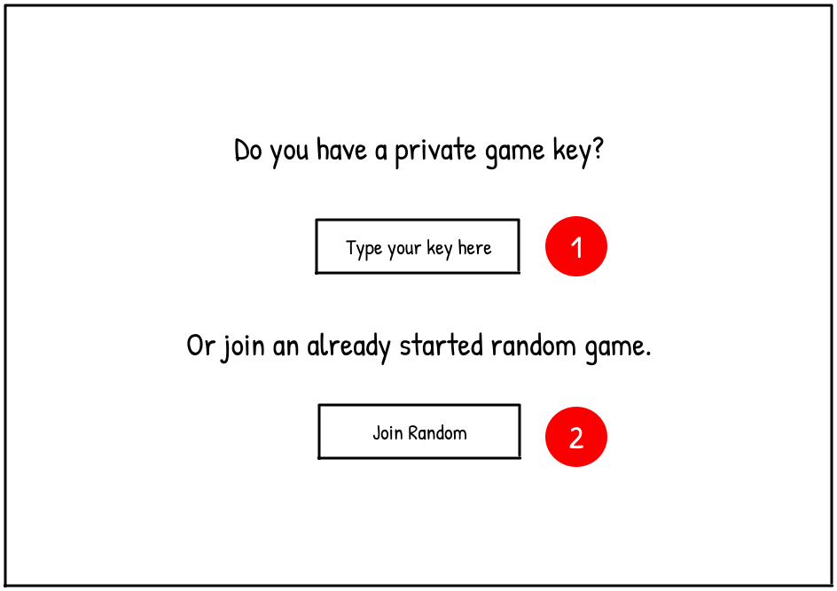

## Pantalla principal

El propósito de la pantalla principal es permitir al visitante elegir entre las siguientes tres opciones. 

Primera, solicitar ayuda . Si el visitante selecciona la opción de solicitar ayuda será redirigido a la pàntalla de ayuda donde podrá obtener más información respecto al juego. 

Segunda, organizar un juego . Si el visitante elige esta opción será redirigido a la pantalla de organizació de juego donde podrá establer las configuraciones de la partida. 

Tercera, unirse a un juego . Si el jugador elige esta opción se le mostrará una ventana emergente (Figura 2) donde puede eligir de qué forma desea ingresar a una partida.

​                                                                                                                      Figura 1. Pantalla principal

## Pantalla de ayuda

El propósito de esta pantalla es permitirle al visitante obtener información adicional referente cómo organizar una partida , cómo jugar  (reglas del juego) y una tercera opción para regresar a la pantalla principal .

Si el visitante escoge la opción de información de cómo organizar una partida , se le mostrará una ventana emergente con las 

                                                                                                                Figura 3. Pantalla de ayuda

​                                                                                                       Figura 4. Cómo organizar una partida

​                                                                                                       Figura 5. Cómo jugar una partida

## Ingresar a una partida

El propósito de esta ventana emergente es permitirle al visitante escoger alguna de las dos modalides disponibles. La primera, unirse a una partida mediante una llave privada . Esta llave es provista por el organizador de la partida. La segunda, unirse a una partida aleatoria  que ya pudo haber comenzado.

​                                                                                            Figura 2. Ventana emergente para unirse a partida
