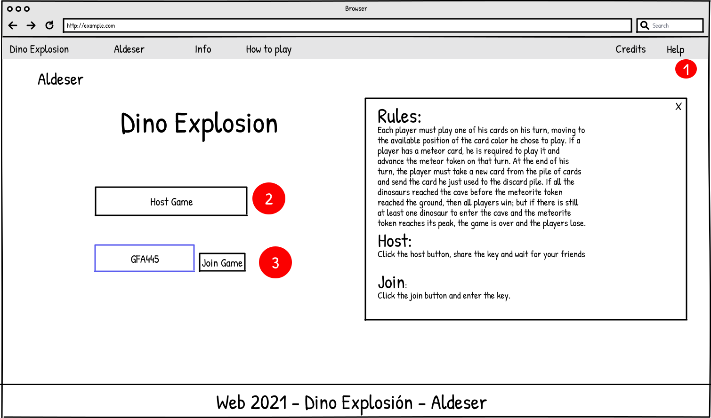

## Pantalla principal

El propósito de la pantalla principal es permitir al visitante elegir entre las siguientes tres opciones. 

Primera, solicitar ayuda .  Si el visitante selecciona la opción de solicitar ayuda será redirigido a la pantalla de ayuda ([Figura 2](pantalla-ayuda)) donde podrá obtener más información respecto al juego. Segunda, organizar un juego .  Si el visitante elige esta opción será redirigido a la pantalla de organización de juego donde podrá establer las configuraciones de la partida ([Figura 5](pantalla-organizacion-partida)). Tercera, unirse a un juego . Si el jugador elige esta opción se le mostrará una ventana emergente (Figura 5) donde puede eligir de qué forma desea ingresar a una partida.

Figura 1. Pantalla principal

## Pantalla de ayuda

El propósito de esta pantalla es permitirle al visitante obtener información adicional referente cómo organizar una partida , cómo jugar  (reglas del juego) y una tercera opción para regresar a la pantalla principal . Si el visitante escoge la opción de información de cómo organizar una partida , se le mostrará una ventana emergente con la información de cómo organizar una partida ([Figura 3](como-organizar). Por otra parte, si escoge la opción de cómo jugar , se le mostrará la una ventana emergente con la reglas del juego ([Figura 4](como-organizar)). Asimismo, el visitante tiene disponible la opción de regresar a la página principal . ([Figura 1](pantalla-principal)).

 Figura 2. Pantalla de ayuda

​                                                           Figura 3. Cómo organizar una partida

​                                                           Figura 4. Cómo jugar una partida

## Organizar una partida

El propósito de esta ventana emergente es permitirle al oganizardor de la partida establecer las configuraciones de la partida. Por ejemplo, establecer la cantidad máxima de jugadores , establecer la duración de la partida , establecer la probabilidad de encontrarse un bomba en los espacios disponibles  y establecer la probabilidad de encontrarse alguna mejora de habilidad en los espacios  entre otras. Adicionalmente, el organizardor tiene la posibilidad de cancelar la configuración y vover a la pantalla principal  y confirmar la configuración lo que establecerá por creada la partida y llevará al organizador a la sala de espera ([Figura X]()).

Figura 5. Organización de partida.

## Ingresar a una partida

El propósito de esta ventana emergente es permitirle al visitante escoger alguna de las dos modalides disponibles. La primera, unirse a una partida mediante una llave privada . Esta llave es provista por el organizador de la partida. La segunda, unirse a una partida aleatoria  que ya pudo haber comenzado.

​                                                                                            Figura 5. Ventana emergente para unirse a partida