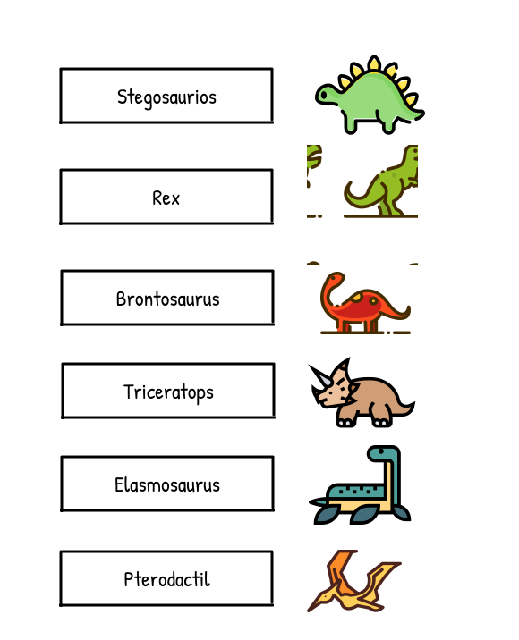

## Mapa del sitio

A continuación se detalla el diseño del mapa del sitio.

## Pantalla principal

El propósito de la pantalla principal es permitir al visitante elegir entre las siguientes tres opciones. 

Primera, solicitar ayuda . Segunda, organizar un juego . Si el visitante elige esta opción será redirigido a la pantalla de espera de juego. Tercera, unirse a un juego . 

Figura 1. Pantalla principal

 Figura 2. Opción de ayuda
Si el visitante selecciona la opción de solicitar ayuda se desplegará en la pantalla un mensaje (Figura 2) donde podrá obtener más información respecto al juego.

 Figura 3. Unirse a partida
Si el jugador elige esta opción se le mostrará la opción de ingresar la llave de una partida ya iniciada (Figura 3).
## Sala de espera

El propósito de esta ventana (Figura 4) es permitirle al anfitrión de la partida visualizar a los participantes entrantes a la partida y establecer las configuraciones de la partida: establecer la probabilidad de encontrarse un geyser, la probabilidad de encontrarse huevos o binoculares en los espacios disponibles. 
El anfitrión estara diferenciado ya que aparecera de primero en la lista de jugadores y para los demás jugadores su nombre aparecera en rojo. Cuando el anfitrión realice un cambio en la configuración se le mostrara a los demás jugadores y si algun jugador cambia su nombre este cambio se le mostrara a los demás.

Figura 4. Sala de espera para anfitrión.
Si el anfitrión abandona la partida el juego se cancela y expulsa a los demás jugadores.

Figura 5. Cambiar de avatar.
Tambien haciendo click en los avatars se presenta la opcion de cambiar de dinosaurio. 

Figura 6. Sala de espera para jugadores.
Los participantes visualizaran una pantalla similar con la diferencia de que no pueden cambiar las configuraciones.
Si los jugadores abandonan la partida la partida seguira normalmente hasta que el host la termine.
## Juego

En esta pantalla se permite a los jugadores jugar de acuerdo a su turno. El número  representa la barra de turnos o barra de proximidad, los jugadores pueden jugar mientras el meteorito no llegue a la tierra. El número  muestra la caja de jugadores que contiene sus nombres, dinosaurio y su mano de cartas. El número  es el boton para pasar turno. El número  muestra el tablero y el número  el boton para abandonar la partida y regresar a la pagina de Home.

Figura 7.  Ejemplo de juego
Se tocan las cartas correspondientes al personaje de cada jugador para que el dinosaurio avance hacia la casilla del color seleccionado más cercano y se pasa de turno, al jugar una carta el juego le proporcionara otra para tener en su mano 3 cartas en todo momento.
Si se tiene una carta de meteorito se jugara y se movera el meteorito de la barra de turnos y se pasa de turno.
Al caer en un geyser el jugador se devolvera a su casilla en la que estaba y la casilla donde estaba el geyser queda inutilizable.
Al caer en un huevo se permitira al jugador volver a jugar en su turno.
Al caer en un binocular se permitira ver el geyser más cercano.

Figura 8. Calificación final

Al finalizar el juego o el tiempo se presentan las calificaciones y el scoreboard, un botón para regresar a la pantalla principal o para volver a jugar si el anfitrión no salio.
