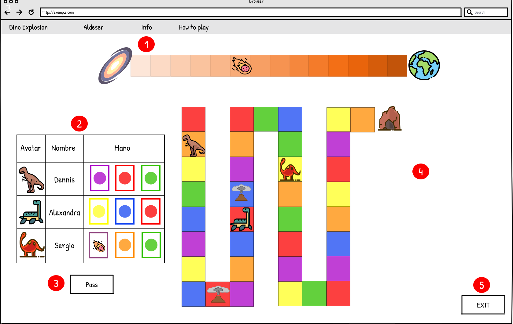
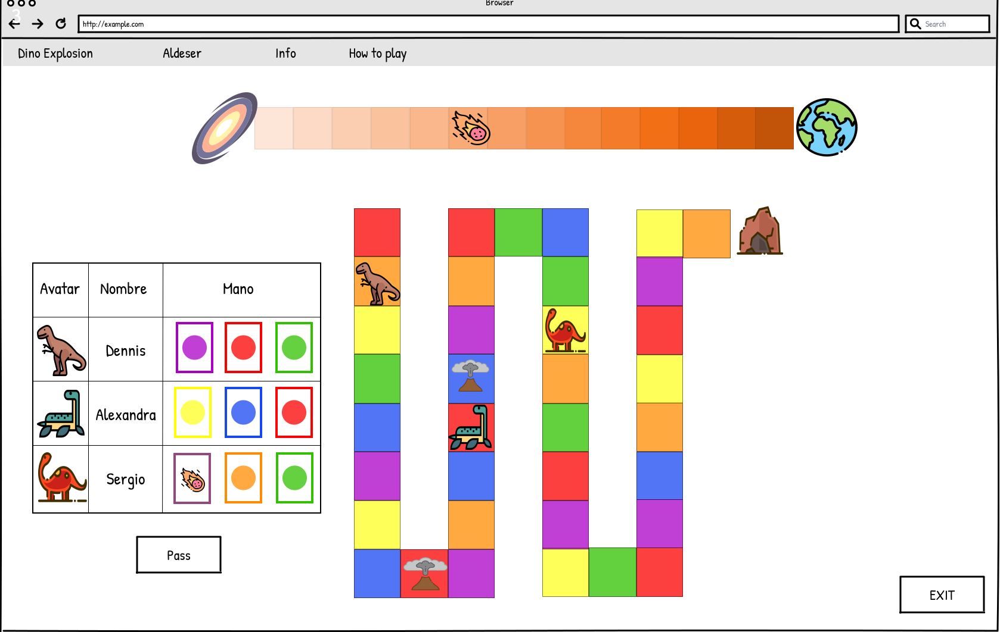

## Mapa del sitio

A continuación se detalla el diseño del mapa del sitio.

## Pantalla principal

El propósito de la pantalla principal es permitir al visitante elegir entre las siguientes tres opciones. 

Primera, solicitar ayuda .  Si el visitante selecciona la opción de solicitar ayuda se desplegará en la pantalla un mensaje (Figura 2) donde podrá obtener más información respecto al juego. Segunda, organizar un juego .  Si el visitante elige esta opción será redirigido a la pantalla de espera de juego. Tercera, unirse a un juego . Si el jugador elige esta opción se le mostrará la opción de ingresar la llave de una partida ya iniciada (Figura 3).

Figura 1. Pantalla principal

 Figura 2. Opción de ayuda

 Figura 3. Unirse a partida

## Sala de espera

El propósito de esta ventana (Figura 4) es permitirle al anfitrión de la partida establecer las configuraciones de la partida y visualizar a los participantes entrantes a la partida. Por ejemplo,establecer la probabilidad de encontrarse un bomba en los espacios disponibles y establecer la probabilidad de encontrarse alguna mejora entre otras, tambien haciendo clik en los avatars se presenta la opcion de cambiar de dinosaurio (Figura 5). Los participantes visualizaran una pantalla similar con la diferencia de que no pueden cambiar las configuraciones. (Figura 6).

Figura 4. Sala de espera para anfitrión.

Figura 5. Cambiar de avatar.

Figura 6. Sala de espera para jugadores.
## Juego

Figura 7.  Pantalla de juego

En esta pantalla se permite a los jugadores jugar de acuerdo a su turno

Figura 8.  Ejemplo de juego

Figura 9. Calificación final

Al finalizar el juego o el tiempo se presentan los jugadores ganadores y sus calificaciones, un botón para regresar a la pantalla principal o para volver a jugar si el anfitrión no salio.
